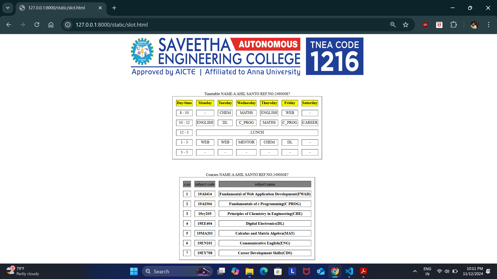

# Ex03 Time Table
## Date:12.11.24

## AIM
To write a html webpage page to display your slot timetable.

## ALGORITHM
### STEP 1
Create a Django-admin Interface.

### STEP 2
Create a static folder and inert HTML code.

### STEP 3
Create a simple table using ```<table>``` tag in html.

### STEP 4
Add header row using ```<th>``` tag.

### STEP 5
Add your timetable using ```<td>``` tag.

### STEP 6
Execute the program using runserver command.

## PROGRAM

```
<html>
    <body>
        <center>
            
        </center>
        <pre>

        </pre>
        <table border="1" cellspacing="15" cellpadding="2" align="center">
            <caption>Timetable  NAME:A AHIL SANTO    REF.NO:24900087</caption>
            <tr bgcolor="yellow">
                <th>Day/time</th>
                <th>Monday</th>
                <th>Tuesday</th>
                <th>Wednesday</th>
                <th>Thursday</th>
                <th>Friday</th>
                <th>Saturday</th>
            </tr>
            <tr align="center">
                <td>8 - 10</td>
                <td colspan="1">  -  </td>
                <td>CHEM</td>
                <td>MATHS</td>
                <td>ENGLISH</td>
                <td>WEB</td>
                <td> - </td>

            </tr>
            <tr align="center">
                <td>10 - 12</td>
                
                <td colspan="1">ENGLISH</td>
                <td>DL</td>
                <td>C_PROG</td>
                <td>MATHS</td>
                <td>C_PROG</td>
                <td>CAREER</td>
            </tr>

            <tr>
                <td align="center">12 - 1</td>
                <td colspan="6" align="center">LUNCH</td>
            </tr>

            <tr align="center">
                <td>1 - 3</td>
                <td colspan="1">WEB</td>
                <td>WEB</td>
                <td>MENTOR</td>
                <td>CHEM</td>
                <td>DL</td>
                <td> -  </td>
            </tr>

            <tr align="center">
                <td>3 - 5</td>
                <td colspan="1"> -  </td>
                <td> -  </td>
                <td> -  </td>
                <td> -  </td>
                <td> -  </td>
                <td> -  </td>
            </tr>
          

        </table >
        <pre>

        </pre>      
        <table border="1" cellspacing="15" cellpadding="2" align="center">
        <caption>Courses  NAME:A AHIL SANTO    REF.NO:24900087</caption>
        <tr bgcolor="grey">
            <td>s.no</td>
            <td colspan="2">subject code </td>
            <td colspan="4" align="center">subject name </td>
        </tr>

        <tr>
            <th>1</th>
            <th colspan="2">19AI414</th>
            <th colspan="3">Fundamental of Web Application Development(FWAD)</th>
        </tr>

        <tr>
            <th>2</th>
            <th colspan="2">19AI304</th>
            <th colspan="3">Fundamentals of c Programming(C PROG)</th>
        </tr>

        <tr>
            <th>3</th>
            <th colspan="2">19cy205</th>
            <th colspan="3">Principles of Chemistry in Engineering(CHE)</th>
        </tr>

        <tr>
            <th>4</th>
            <th colspan="2">19EE404</th>
            <th colspan="3">Digital Electronics(DL)</th>
        </tr>

        <tr>
            <th>5</th>
            <th colspan="2">19MA201</th>
            <th colspan="3">Calculus and Matrix Algebra(MAT)</th>
        </tr>

        <tr>
            <th>6</th>
            <th colspan="2">19EN101</th>
            <th colspan="3">Communicative English(ENG)</th>
        </tr>

        <tr>
            <th>7</th>
            <th colspan="2">19EY708</th>
            <th colspan="3">Career Development Skills(CDS)</th>
        </tr>
        
    </table>
    </body>
</html>
```

## OUTPUT 



## RESULT
The program for creating slot timetable using basic HTML tags is executed successfully.
